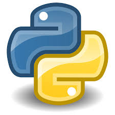
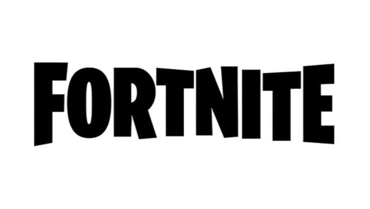
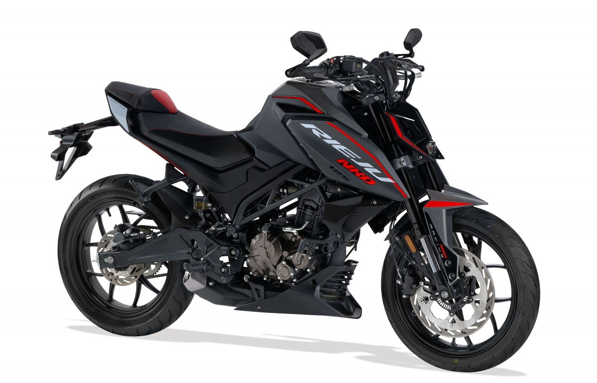
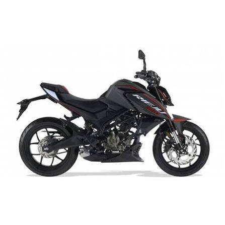

# 👋 Benvinguts a la Wiki Personal de Pau

Aquesta és la meva wiki personal on comparteixo informació sobre mi, els meus interessos i els meus projectes.

## 📚 Sobre mi

Em dic **Pau** i tinc 18 anys. Actualment curso **primer de Desenvolupament d'Aplicacions Web (DAW)** a l'Escola Pia de Mataró.

Sóc un estudiant appassionat per la tecnologia i el desenvolupament web, amb interès en crear solucions creatives i funcionals.

## 💻 Habilitats Tècniques

- **Llenguatges**: Python, HTML...
- **Frameworks**: DAW 1
- **Outils**: Git, GitHub, Visual Studio Code
- **Bases de dades**: MySQL, DBngin, Workbench

## 📞 Contacte

- **Email**: alu.pau.constanseu@mataro.epiaedu.cat
- **GitHub**: [https://github.com/PauConstanseu](https://github.com/PauConstanseu)

## 🎮 Videojocs Preferits

| Joc | Gènere |
|-----|--------|
| Valorant | Shooter tàctic |
| Fortnite | Battle Royale |
| Resident Evil | Horror |

**A Fortnite tinc més de 3500 hores de joc i he guanyat més de 1.000€ en tornejos oficials**

## 🎬 Pel·lícules Preferides

- **Cars** - Animació
- **Star Wars** - Ciència Ficció
- **Fast and Furious** - Acció

## 🎵 Música

Escolto una gran varietat de gèneres, amb preferència per la música moderna:
- Reggaeton
- Trap

Alguns dels meus artistes preferits són: JC Reyes, Cano, Clarent, Omar Courtz, Hades66...

## 🏍️ Transport

- Actualment tinc una moto, una Rieju NKD 125 del 2026
- Em trobo en procés de treure el carnet de cotxe
- En un any, amb el carnet A2 de moto, tinc previst comprar-me una moto d'una major cilindrada, uns 700cc.

La meva moto:

## 🌍 Idiomes

- **Català** - Natiu
- **Castellà** - Natiu
- **Anglès** - B2
- **Neerlandes** - Nivell mitjà

## 🎨 Hobbies i Interessos

- Esports en general, com gimnàs, pàdel, futbol...
- Competició en videojocs
- Fer rutes en moto

Dedico aproximadament 15 hores setmanals a esports, caps de setmana tornejos online de videojocs...
